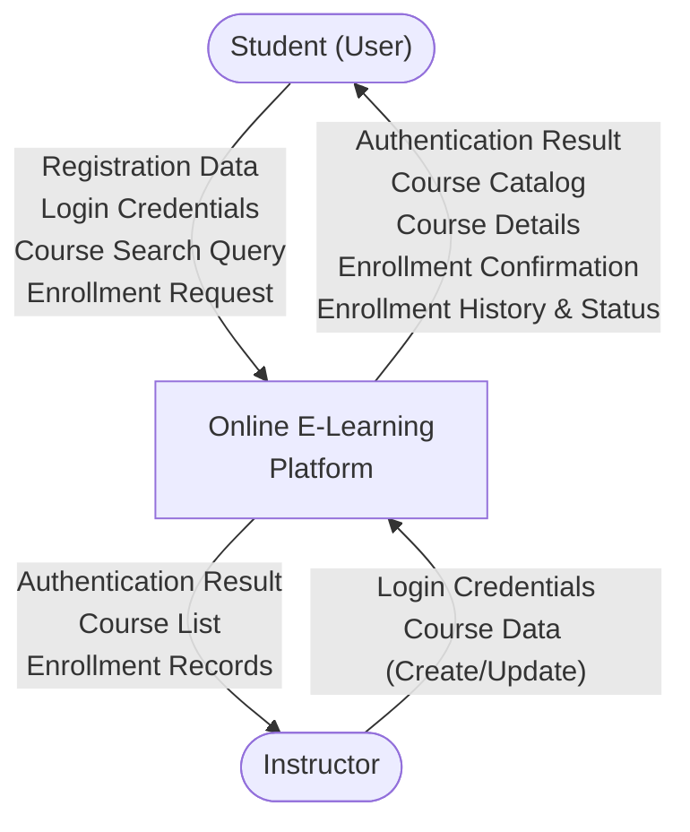
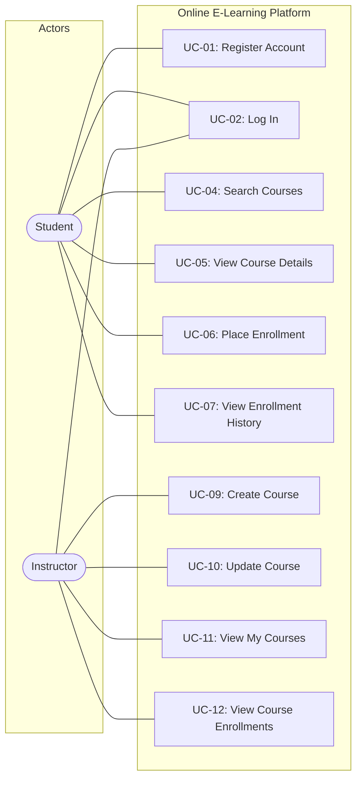
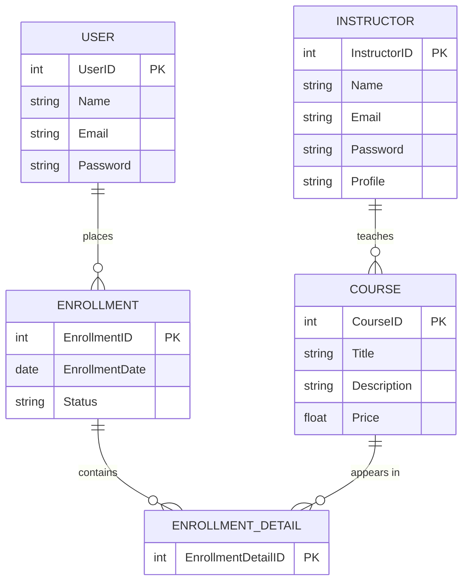

# Q1

---

# Software Requirements Specification

# for

# Online E-Learning Platform

## Version 1.0 approved

**Prepared by**

\<Full Name – StudentID\>

\<FPT University – Can Tho Campus\>

March 16, 2026

---

## 1. Introduction

### 1.1 Purpose

This document specifies the software requirements for the **Online E-Learning Platform**, a web-based system developed for an educational company to improve the learning experience and course management.

### 1.2 Document Conventions

This SRS follows IEEE 830 standard conventions. All requirements are prioritized based on system description.

### 1.3 Intended Audience and Reading Suggestions

- Developers, testers, project managers, and instructors involved in the development of the platform.

### 1.4 Product Scope

The Online E-Learning Platform allows Students to register, search courses, enroll in courses, and view enrollment history. Instructors can manage courses and monitor enrollments. The system aims to streamline online education delivery and course management.

### 1.5 References

- System description provided in Lab exam document (SWR301).

---

# Q2: Context Diagram

## External Entities

| # | External Entity | Description |
|---|-----------------|-------------|
| 01 | Student (User) | End-users who register, search courses, place enrollments, and view enrollment history |
| 02 | Instructor | Educators who authenticate, manage courses (create/update), and monitor enrollments associated with their courses |

## Main Data Flows

| # | Data Flow | Direction | Description |
|---|-----------|-----------|-------------|
| 01 | Registration Data | Student → System | Student submits registration information (name, email, password) |
| 02 | Login Credentials | Student/Instructor → System | Credentials for authentication |
| 03 | Authentication Result | System → Student/Instructor | Confirmation or rejection of login attempt |
| 04 | Course Search Query | Student → System | Keywords or filters to search for specific courses |
| 05 | Course Catalog / Course Details | System → Student | List of available courses and detailed course information (title, description, price, instructor profile) |
| 06 | Enrollment Request | Student → System | Selected course(s) to enroll in |
| 07 | Enrollment Confirmation / History & Status | System → Student | Confirmation of enrollment and tracking information (Pending, Confirmed, Canceled) |
| 08 | Course Data (Create/Update) | Instructor → System | New course information or updates to existing course details |
| 09 | Course List | System → Instructor | List of all courses the instructor is currently teaching |
| 10 | Enrollment Records | System → Instructor | Enrollments associated with the instructor's courses |

---

# Q3: Use Case Diagram

## Actors Table

| # | Actor | Description |
|---|-------|-------------|
| 01 | Student (User) | A registered end-user who can search courses, enroll in courses, and view enrollment history |
| 02 | Instructor | An educator who manages courses and monitors student enrollments in their courses |

## Use Cases Table

| # | Use Case | Actors | Description |
|---|----------|--------|-------------|
| UC-01 | Register Account | Student | Student creates a new account by providing registration details |
| UC-02 | Log In | Student, Instructor | User authenticates into the system using their credentials |
| UC-04 | Search Courses | Student | Student searches for specific courses using keywords or filters |
| UC-05 | View Course Details | Student | Student views detailed information about a course including title, description, price, and instructor profile |
| UC-06 | Place Enrollment | Student | Student selects one or multiple courses and places an enrollment |
| UC-07 | View Enrollment History | Student | Student views the history of all their past and current enrollments and tracks their enrollment status |
| UC-09 | Create Course | Instructor | Instructor creates a new course with title, description, and price |
| UC-10 | Update Course | Instructor | Instructor modifies existing course details such as price or description |
| UC-11 | View My Courses | Instructor | Instructor views the list of all courses they are currently teaching |
| UC-12 | View Course Enrollments | Instructor | Instructor views the enrollments associated with their courses to see which students have registered |

---

# Q4: Conceptual ERD

## Entity Table

| # | Entity | Description |
|---|--------|-------------|
| 01 | USER | Represents a student who registers, logs in, searches courses, and places enrollments |
| 02 | INSTRUCTOR | Represents an educator who creates and manages courses and monitors enrollments |
| 03 | COURSE | Represents a learning course with title, description, price, and an assigned instructor |
| 04 | ENROLLMENT | Represents an enrollment placed by a single user; has a status (Pending, Confirmed, Canceled) |
| 05 | ENROLLMENT_DETAIL | Associative entity that resolves the many-to-many relationship between Enrollment and Course (an enrollment can contain many courses; a course can appear in many enrollments) |

## Relationships

| # | Relationship | Cardinality | Description |
|---|-------------|-------------|-------------|
| 01 | USER – ENROLLMENT | 1 : N | Each user can place many enrollments; each enrollment is placed by exactly one user |
| 02 | INSTRUCTOR – COURSE | 1 : N | Each instructor can teach many courses; each course is managed by exactly one instructor |
| 03 | ENROLLMENT – ENROLLMENT_DETAIL | 1 : N | Each enrollment can contain many enrollment detail records |
| 04 | COURSE – ENROLLMENT_DETAIL | 1 : N | Each course can appear in many enrollment detail records |

---

# Q5: Business Rules

| ID | Rule Definition | Use Cases |
|----|-----------------|-----------|
| BR-01 | Users (Students) must register and log in before accessing any system features (searching, enrolling). | UC-01, UC-02 |
| BR-02 | Instructors must authenticate to the system before managing courses or viewing enrollments. | UC-02 |
| BR-03 | Each course must be managed by exactly one instructor. An instructor can teach multiple courses. | UC-09, UC-10, UC-11 |
| BR-04 | Each enrollment is placed by a single user and can contain one or multiple courses. A course can appear in multiple different enrollments. | UC-06, UC-07 |
| BR-05 | Every enrollment must have a trackable status with valid values: **Pending**, **Confirmed**, or **Canceled**. | UC-06 |
| BR-06 | A course must have a title, description, price, and an associated instructor profile visible to students. | UC-05, UC-09, UC-10 |
| BR-07 | Instructors can only view and manage courses that they themselves are teaching; they can only view enrollments associated with their own courses. | UC-11, UC-12 |
| BR-08 | Students can view their own enrollment history and track the status of their own enrollments only. | UC-07 |

---

> **Note**: Replace `<Full Name – StudentID>` and `<FPT University – Can Tho Campus>` on the cover page with your actual student information before submission.
